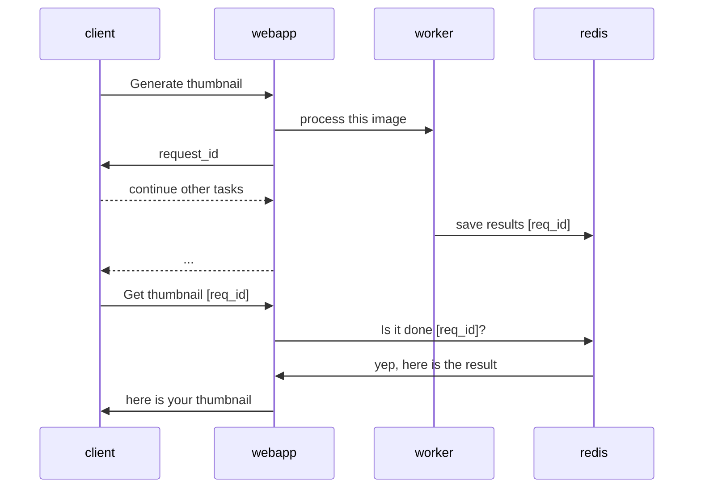
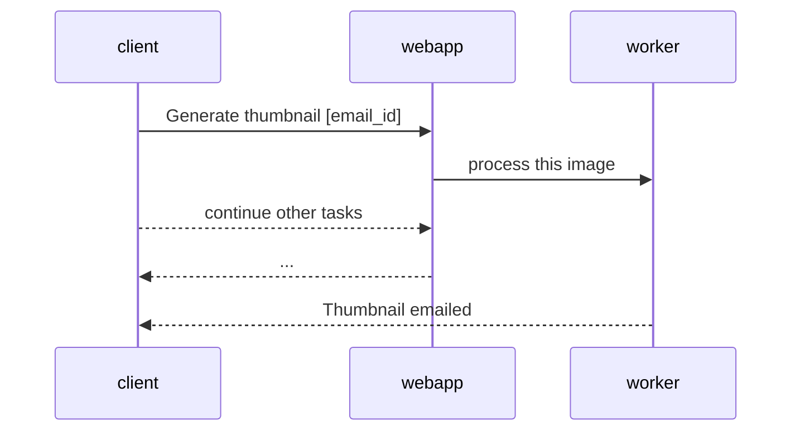

# Thumbnailed

[This file uses mermaidjs which might not be rendered on kramdown. I have created pdf version of this file which shows the diagrams too. Please check index.html in this same folder.]

## Technologies used

1. Python 3.6
    - Web framework : [Fast Api](https://fastapi.tiangolo.com/)
    - Server : [Uvicorn - ASGI server](https://www.uvicorn.org/)
    - Queue Processing : [Python rq](https://python-rq.org/)
    - Testing : [Pytest](https://docs.pytest.org/en/latest/)
2. Redis 4
    - Using redis queues for job processing
3. Docker
    - Containerization and deployment

## Design

### Architecture

Image processing is CPU intensive and possibly a time consuming process. Hence, it is better to run such processing asynchronously in the background. I have used `redis` as a message queue. The reason for using redis is that, it is extremely fast, easy to set up and can be used in a distributed environment easily. It can be fine tuned to provide high availability or high consistency.

I have used python rq library, which creates a separate worker process that executes jobs from the queues. We can spawn as many workers as needed. There are wrapper [libraries](http://supervisord.org/) for managing multiple workers. Hence we can easily scale our application by creating more workers.

Since a long running job could take time to process there are two ways in which client can get the result

1. Pull - The client will poll and `pull` the results from the app. I have provided an api to check status of the process, the job returns the image if the process is completed.

2. Push - The application will `push` result to the client. The client can pass his/her email and the application will email them the generated thumbnail.

The first mechanism of polling might not be that good and hence I would prefer the second approach of `Push` in the actual application. The client could also provide a callback url where we can `POST` the results.

## Future improvements

### Queue processing

It is possible that a worker thread could die or throw error. Python rq provides ways to check failed processes, also it provides options to try on failure.

### Scaling

1. Vertical Scaling: In this demo app, I have created a single worker process. We can create multiple worker processes to make processing faster. Example this [library](http://supervisord.org/) can be used.

2. Horizontal Scaling: Multiple instances of the app can be deployed [with a LB to evenly distribute the load] as far as they all connect to same redis instance. To ensure redis is also highly available we can create a cluster with master slave replication.

### Monitoring

1. Jobs - Python rq provides a nice monitoring [dashboard](https://python-rq.org/docs/monitoring/) the jobs.
2. Redis - redis sentinels can be configured to alert us when some issues happen on the redis cluster.
3. Web-app - Splunk/Appdynamics/ or other cloud tools if deployed to cloud

### Testing

Currently I have written some basic unit tests. We can additionally test the rest api with Soap UI or my personal favorite web api testing framework - [karate](https://github.com/intuit/karate)

### Security

1. Need to handle limit to image size upload.
2. Correctly check file mimetype to prevent harmful files from getting uploaded to server.
3. Currently there is no authentication, depending on the use case we could add auth layer to this service.
4. Prevent DOS/DDoS attack.

### API

Currently we accept image url to generate thumbnails, we could allow users to upload the image. For file storage we can use S3 or Google cloud storage if we deploy this to cloud. Also provide an api for the client to get a callback.

